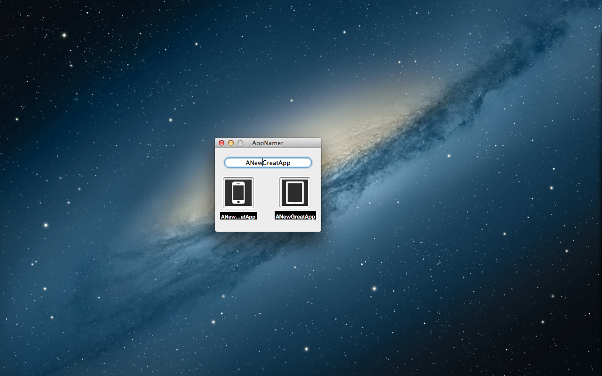

AppNamer
========

OS X App that allows users to test a name for a iOS app and make an idea of how will look in springboard. Will help users to know if the name will be truncated or not.

This application is now out of the App Store. Since I am not supporting it anymore, I released the code.

## License

See [License.markdown](LICENSE.markdown)